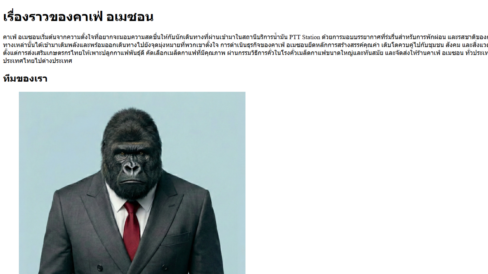
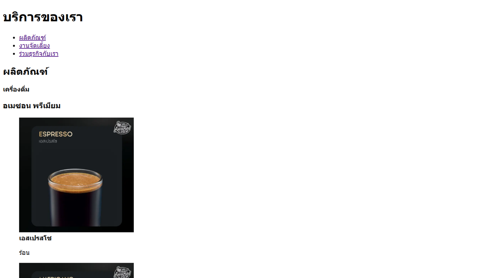
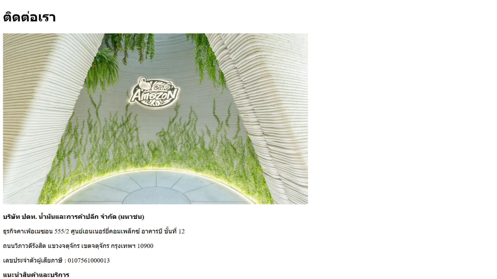

# Create a Café Amazon website
## Projecet description
- นี่คือการจำลองหน้าเว็บไซต์ Café Amazon เบื้องต้น
- สร้างขึ้นเพื่อเรียนรู้เกี่ยวกับวิธีสร้างหน้าเว็บไซต์
- เพื่อศึกษาเกี่ยวกับ HTML เบื้องต้น
- ไม่มีการใช้ CSS หรือ JavaScript
## File structure
- **index.html** - Home page for Cafe Amazon website
- **about.html** - About for Cafe Amazon website
- **services.html** - Services for Cafe Amazon website
- **contact.html** - Contact for Cafe Amazon website
- **images** - Images for use in Cafe Amazon website
- **README.md** - Project documentation
## All screenshots and links to each page
1. [คลิกเพื่อดูหน้าหลัก /index.html](/index.html)

2. [คลิกเพื่อดูเกี่ยวกับ /about.html](/about.html)

3. [คลิกเพื่อดูบริการ /services.html](/services.html)

4. [คลิกเพื่อดูติดต่อ /contact.html](/contact.html)

