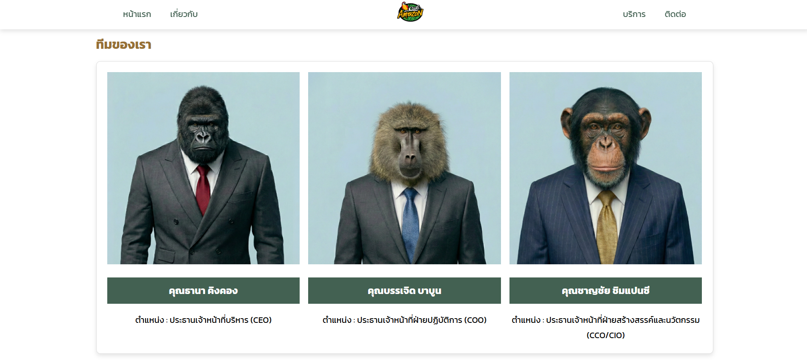
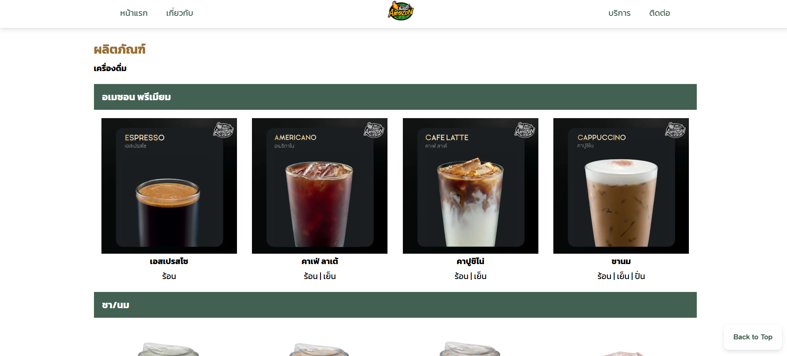
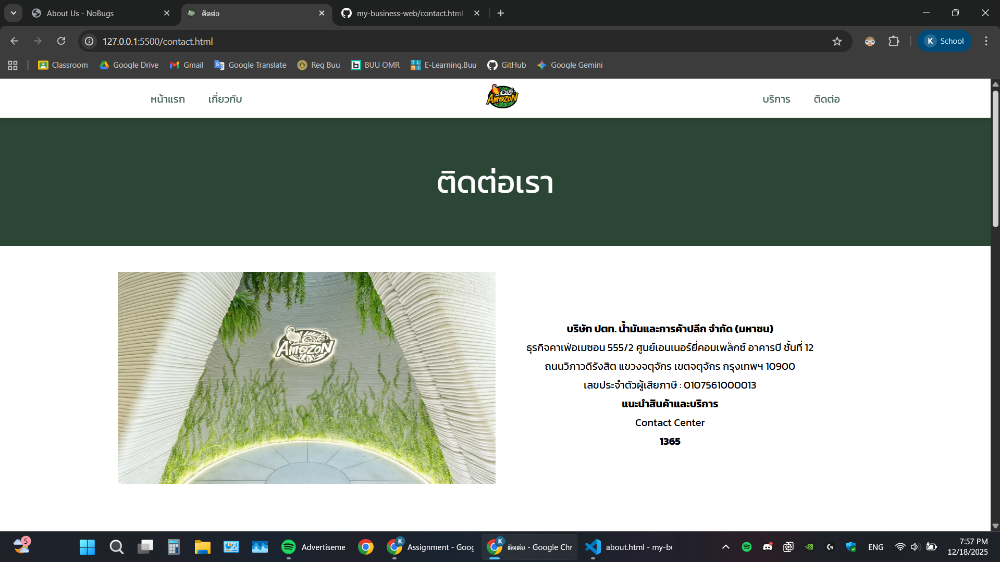

# Create a Café Amazon website

## Projecet description

- นี่คือการจำลองหน้าเว็บไซต์ Café Amazon
- สร้างขึ้นเพื่อเรียนรู้เกี่ยวกับวิธีสร้างหน้าเว็บไซต์และการตกแต่งหน้าเว็บ
- เพื่อศึกษาเกี่ยวกับ HTML, CSS เบื้องต้น
- ไม่มีการใช้ JavaScript

## File structure

my-business-web/
├── index.html
├── about.html
├── services.html
├── contact.html
├── css/
│ └── styles.css
├── Pictures/
│ └── ...
└── README.md

## CSS Implementation

### Selectors
| Type | Examples | Usage |
|------|----------|-------|
| Universal | `*` | Reset margin, padding, box-sizing |
| Element | `h1`, `h2`, `p`, `a`, `table`, `form` | Base typography and elements |
| Class | `.hero`, `.card`, `.btn`, `.team`, `.services` | Reusable components |
| ID | `#header`, `#footer` | Unique page sections |
| Pseudo-class | `:hover`, `:active`, `:focus`, `:last-child`, `::after` | Interactive states |

### CSS Units
| Unit | Usage |
|------|-------|
| `px` | Borders, box-shadows, small fixed spacing |
| `rem` | Font sizes, margins, paddings |
| `%` | Container widths, responsive images |
| `vh` | Hero section height (100vh) |
| `vw` | Viewport-based font sizes |

### Color Palette
| Color | Hex Code | Usage |
|-------|----------|-------|
| Primary | `#436152` | Header, Footer background |
| Secondary | `#ffffff` | Buttons, Links, Accents |
| Accent | `#2b4635` | Submit buttons, Highlights |
| Neutral | `#977035` | Secondary text |
| Light | `#f4f2f1` | Page background |

### Typography
- **Font Family:** Kanit
- **Font Weights:** 400 (normal), 600 (semi-bold), 700 (bold)
- **Line Height:** 1.6 (body), 1.8 (paragraphs)
- **Text Effects:** `text-transform`, `text-shadow`

### Box Model
- **Padding:** Used on containers, cards, buttons, header, footer
- **Margin:** Spacing between sections and elements
- **Border:** Card accents, input fields, table cells
- **Border-radius:** Rounded corners (8px, 10px, 50%)

### Positioning & Layout
| Property | Usage |
|----------|-------|
| `position: sticky` | Header stays at top when scrolling |
| `position: fixed` | Back-to-top button, chat widget |
| `position: absolute` | Hero overlay effect |
| `position: relative` | Parent for absolute children |

### Display & Layout Systems
| System | Usage |
|--------|-------|
| `display: flex` | Header navigation, services cards, form layout |
| `display: grid` | Team members section (auto-fit columns) |
| `flex-wrap: wrap` | Responsive card wrapping |
| `justify-content` | Centering and spacing items |
| `align-items` | Vertical alignment |

### Hover & Interaction Effects
| Effect | CSS Properties |
|--------|----------------|
| Button hover | `transform: translateY(-2px)`, `box-shadow` |
| Card hover | `transform: translateY(-2px)`, border color change |
| Link hover | Color change, underline animation |
| Transitions | `transition: all 0.3s ease` |

### Responsive Design
| Breakpoint | Changes |
|------------|---------|
| `768px` | Stack header, smaller fonts, column layout |
| `480px` | Smaller buttons, reduced padding |
| `376px` | For mobile phones |

## All screenshots and links to each page

1. [คลิกเพื่อดูหน้าหลัก /index.html](/index.html)

2. [คลิกเพื่อดูเกี่ยวกับ /about.html](/about.html)

3. [คลิกเพื่อดูบริการ /services.html](/services.html)

4. [คลิกเพื่อดูติดต่อ /contact.html](/contact.html)

